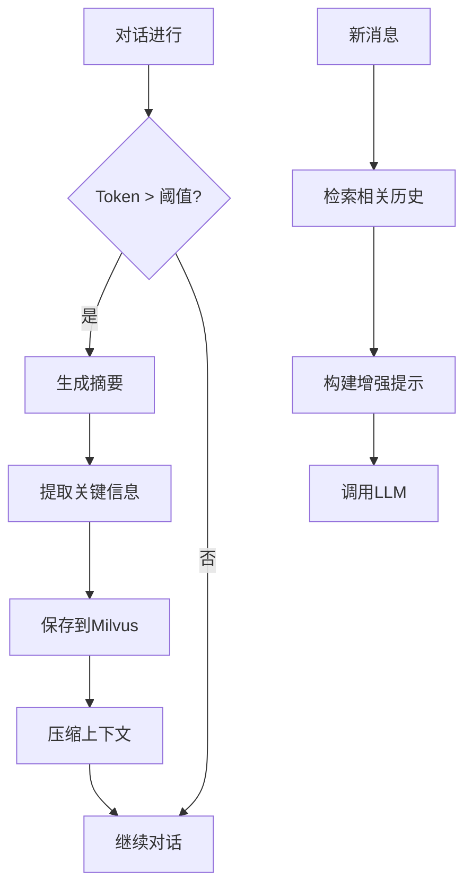

# 长上下文保存系统（Context Preservation System）

基于 RAG 技术的长上下文保存与检索系统，解决 LLM 对话中的长上下文问题。

## 核心特性

- **自动保存**：Token 超过阈值自动触发保存
- **智能摘要**：LLM 生成结构化摘要
- **关键信息提取**：提取实体、任务、决策等
- **语义检索**：基于向量数据库的语义检索
- **上下文增强**：检索历史注入当前对话

## 架构



## 快速开始

### 方案一：使用阿里云灵积（推荐，免费额度）

```bash
# 1. 获取阿里云灵积 API Key
# 访问 https://dashscope.aliyun.com/ 注册并获取 API Key

# 2. 配置环境变量
export DASHSCOPE_API_KEY=your-dashscope-key

# 3. 启动服务
docker-compose up -d

# 4. 运行应用
./mvnw spring-boot:run
```

### 方案二：使用 OpenAI（需要 API Key）

```bash
export OPENAI_API_KEY=your-openai-key
./mvnw spring-boot:run
```

### 方案三：无 LLM 模式（仅 Embedding）

不配置任何 Key，系统会自动降级：
- 使用阿里云灵积 Embedding
- 摘要和关键信息提取使用简单规则
- 适合测试和轻量级场景

## API 使用

### 发送消息

```bash
curl -X POST http://localhost:8080/api/conversation/message \
  -H "Content-Type: application/json" \
  -d '{"content": "你好，请帮我分析这个问题"}'
```

### 手动保存

```bash
curl -X POST http://localhost:8080/api/conversation/preserve
```

### 检索历史

```bash
curl -X POST http://localhost:8080/api/conversation/retrieve \
  -H "Content-Type: application/json" \
  -d '{"query": "之前讨论的RAG方案"}'
```

## 配置

```yaml
context:
  preservation:
    threshold: 3000  # Token 阈值
  retrieval:
    top-k: 5
    score-threshold: 0.7
```

## 技术栈

- Spring Boot 3.2
- Spring AI
- Milvus 向量数据库
- OpenAI API

## 项目结构

```
src/main/java/com/example/cps/
├── entity/          # 实体类
├── service/         # 核心服务
├── controller/      # REST API
└── ContextPreservationApplication.java
```

## 许可证

MIT
