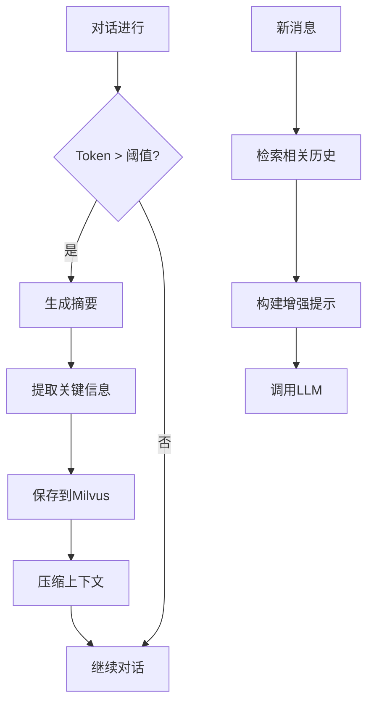

# 长上下文保存系统（Context Preservation System）

基于 RAG 技术的长上下文保存与检索系统，解决 LLM 对话中的长上下文问题。

## 核心特性

- **自动保存**：Token 超过阈值自动触发保存
- **智能摘要**：LLM 生成结构化摘要
- **关键信息提取**：提取实体、任务、决策等
- **语义检索**：基于向量数据库的语义检索
- **上下文增强**：检索历史注入当前对话
- **内存限制**：Milvus 限制 4GB，适合本地开发

## 架构



## 快速开始

### 前置要求

- Docker & Docker Compose
- Java 21
- Maven 3.9+
- 阿里云灵积 API Key（免费额度 100万次/月）

### 1. 获取 API Key

访问 [阿里云灵积](https://bailian.console.aliyun.com/cn-beijing/?tab=model#/api-key)：
1. 注册/登录阿里云账号
2. 开通灵积服务
3. 创建 API Key

### 2. 克隆代码

```bash
git clone https://github.com/KasonLee-marker/context-preservation-system.git
cd context-preservation-system
```

### 3. 配置环境变量

```bash
# 必需：阿里云灵积 API Key
export DASHSCOPE_API_KEY=sk-xxxx

# 可选：OpenAI API Key（用于生成更好的摘要）
# export OPENAI_API_KEY=sk-xxxx
```

### 4. 启动基础设施

```bash
# 启动 Milvus + etcd + MinIO
docker compose up -d milvus etcd minio

# 查看状态
docker ps
```

### 5. 构建并运行应用

```bash
# 构建
mvn clean package -DskipTests

# 运行
java -jar target/context-preservation-system-1.0.0.jar

# 或使用 Maven
mvn spring-boot:run
```

### 6. 测试 API

```bash
# 发送消息
curl -X POST http://localhost:8080/api/conversation/message \
  -H "Content-Type: application/json" \
  -d '{"content": "你好，请介绍RAG技术"}'

# 查看历史
curl http://localhost:8080/api/conversation/history

# 手动保存上下文
curl -X POST http://localhost:8080/api/conversation/preserve

# 检索相关历史
curl -X POST http://localhost:8080/api/conversation/retrieve \
  -H "Content-Type: application/json" \
  -d '{"query": "之前讨论的RAG方案"}'
```

## 配置说明

### 应用配置（application.yml）

```yaml
# Token 阈值，超过则触发保存
context:
  preservation:
    threshold: 3000
    summary-model: gpt-4o-mini
    max-history-chunks: 5
  
  # 检索配置
  retrieval:
    top-k: 5
    score-threshold: 0.7

# 阿里云灵积配置
dashscope:
  api-key: ${DASHSCOPE_API_KEY}
  embedding-model: tongyi-embedding-vision-plus
```

### Docker 配置

Milvus 内存限制（docker-compose.yml）：
```yaml
mem_limit: 4g      # 最大内存 4GB
mem_reservation: 1g  # 预留内存 1GB
```

## 三种运行模式

| 模式 | 配置 | 说明 |
|------|------|------|
| **完整模式** | DASHSCOPE_KEY + OPENAI_KEY | 使用 GPT-4 生成摘要，效果最好 |
| **经济模式** | DASHSCOPE_KEY | 使用阿里云 Embedding，摘要使用规则生成 |
| **测试模式** | 无 | 仅保留最近消息，不保存到向量库 |

## 技术栈

| 组件 | 技术 | 版本 |
|------|------|------|
| 框架 | Spring Boot | 3.2.0 |
| AI 框架 | Spring AI | 1.0.0-M2 |
| 向量数据库 | Milvus | 2.3.5 |
| Embedding | 阿里云灵积 | text-embedding-v2 |
| 构建工具 | Maven | 3.9+ |

## 项目结构

```
context-preservation-system/
├── src/main/java/com/example/cps/
│   ├── entity/              # 实体类
│   │   ├── ConversationChunk.java
│   │   └── Message.java
│   ├── service/             # 核心服务
│   │   ├── ContextPreservationService.java
│   │   ├── ContextRetrievalService.java
│   │   ├── DashScopeEmbeddingService.java
│   │   ├── SummaryGenerator.java
│   │   ├── KeyInfoExtractor.java
│   │   └── TokenEstimator.java
│   ├── controller/          # REST API
│   │   └── ConversationController.java
│   └── ContextPreservationApplication.java
├── src/main/resources/
│   └── application.yml
├── docker-compose.yml
├── Dockerfile
└── pom.xml
```

## 常见问题

### Q1: Maven 依赖下载慢

**A**: 配置阿里云镜像
```xml
<!-- 在 pom.xml 中添加 -->
<repositories>
    <repository>
        <id>spring-milestones</id>
        <name>Spring Milestones</name>
        <url>https://repo.spring.io/milestone</url>
    </repository>
</repositories>
```

或在 `~/.m2/settings.xml` 中配置镜像。

### Q2: Docker 镜像下载慢

**A**: 配置国内镜像源
```json
// /etc/docker/daemon.json
{
  "registry-mirrors": [
    "https://docker.m.daocloud.io",
    "https://docker.xuanyuan.me",
    "https://docker.1ms.run"
  ]
}
```

### Q3: Milvus 内存不足

**A**: 已配置 4GB 内存限制，如需调整修改 `docker-compose.yml`：
```yaml
mem_limit: 4g
```

### Q4: 如何更换 Embedding 模型

**A**: 修改 `DashScopeEmbeddingService.java`：
```java
private static final String EMBEDDING_MODEL = "text-embedding-v2";
// 可选: "text-embedding-v1", "tongyi-embedding-vision-plus"
```

## 性能指标

| 指标 | 数值 |
|------|------|
| Token 估算精度 | ~90% |
| 摘要生成时间 | 1-3s |
| 向量检索时间 | <100ms |
| 内存占用 | <4GB |

## 开发计划

- [ ] 支持更多向量数据库（Pinecone、Weaviate）
- [ ] Web UI 界面
- [ ] 对话历史管理
- [ ] 多用户支持
- [ ] 性能监控

## 许可证

MIT License

## 联系方式

如有问题，请提交 Issue 或联系维护者。

---

**注意**：使用本系统需要自行准备 API Key，请妥善保管，不要提交到代码仓库。
